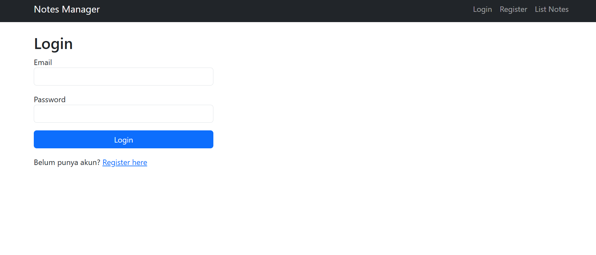
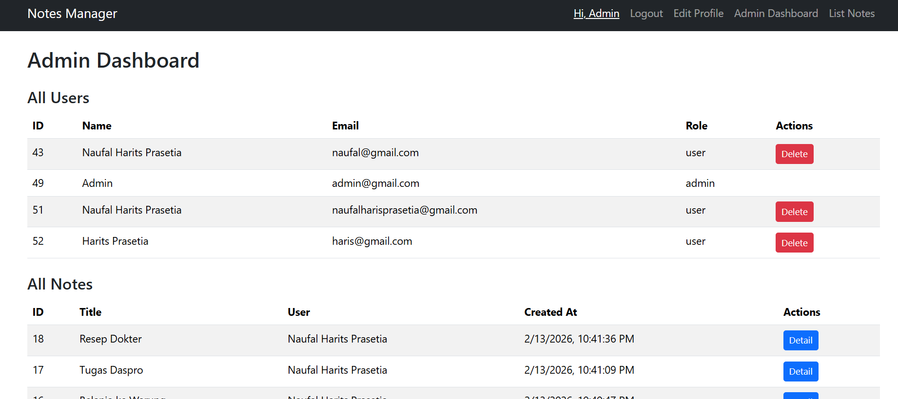

# Notes Manager

## 1. Penjelasan Project

**Notes Manager** adalah aplikasi manajemen catatan (notes) berbasis web yang dibangun menggunakan **NestJS, TypeScript, TypeORM, MySQL, dan EJS**.  
Aplikasi ini memungkinkan pengguna untuk:

- Mendaftar dan login
- Mengelola catatan pribadi (CRUD)
- Melihat catatan berdasarkan user yang login
- Admin memiliki hak istimewa untuk mengelola semua user dan catatan

Tujuan project ini adalah menyediakan **aplikasi CRUD sederhana** dengan arsitektur yang rapi dan mudah dikembangkan.

---

## 2. Desain Database

Aplikasi menggunakan **MySQL** dengan tabel utama:

### Tabel `user`

| Column   | Type    | Keterangan      |
| -------- | ------- | --------------- |
| id       | int PK  | Primary key     |
| name     | varchar | Nama user       |
| email    | varchar | Email unik      |
| password | varchar | Password hashed |
| role     | varchar | user/admin      |

### Tabel `note`

| Column  | Type    | Keterangan               |
| ------- | ------- | ------------------------ |
| id      | int PK  | Primary key              |
| title   | varchar | Judul catatan            |
| content | text    | Isi catatan              |
| userId  | int FK  | Foreign key ke `user.id` |

**Relasi**:

- **User → Notes** : one-to-many
- **Notes → User** : many-to-one

**Diagram (placeholder)**:

| User | ---------- | Note |

| id | | id |
| name | | title|
| email | | content |
| password | | userId |
| role |

---

## 3. Screenshot Aplikasi

> Ganti link di bawah ini dengan screenshot asli aplikasi

  
  


---

## 4. Dependency

Project ini menggunakan beberapa dependency utama:

- `@nestjs/common`, `@nestjs/core`, `@nestjs/platform-express` → NestJS core
- `@nestjs/typeorm` → ORM integration dengan TypeORM
- `typeorm` → Object-Relational Mapping
- `mysql2` → MySQL driver
- `bcrypt` → Password hashing
- `express-session` → Session management
- `connect-flash` → Flash message untuk error/success
- `ejs` → Template engine untuk rendering HTML

> Opsional: `class-validator`, `class-transformer`, `rxjs` (bisa dihapus jika tidak digunakan)

---

## 5. Setup dan Install

1. Clone repository:

```bash
git clone https://github.com/username/notes-manager.git
cd notes-manager
```

Install dependencies:

```bash
npm install
```

Sesuaikan koneksi database di app.module.ts:

```bash
TypeOrmModule.forRoot({
  type: 'mysql',
  host: 'localhost',
  port: 3306,
  username: 'root',
  password: '',
  database: 'notes_manager',
  autoLoadEntities: true,
  synchronize: true,
})
```

Jalankan aplikasi:

```bash
npm run start:dev
```

Akses aplikasi di:

```arduino
http://localhost:3000
```

## 6. Informasi Tambahan

Seeder Admin:
Secara otomatis akan membuat user admin saat aplikasi pertama kali dijalankan:

```makefile
Email: admin@example.com
Password: admin123
```

Folder Structure:

```bash
src/
users/ # User entity, service, controller
notes/ # Notes entity, service, controller
validation.service.ts # Helper validasi manual
main.ts # Bootstrap app + create admin
```

Views:

- Disimpan di views/ menggunakan EJS, termasuk layout dan halaman notes, register, login, edit profile.

Session & Flash Message:

- Menggunakan express-session + connect-flash untuk error/success message.

Future Dev Notes:

- Bisa tambahkan fitur kategori, tag, atau share notes.
- Untuk production, jangan gunakan synchronize: true di TypeORM, gunakan migration.
- Flash message bisa diganti dengan library front-end seperti toastr atau sweetalert.

## 7. Author

Naufal Harits Prasetia

---
